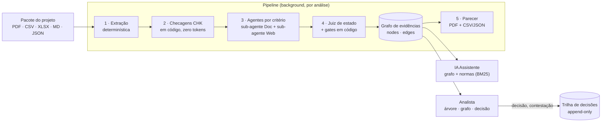
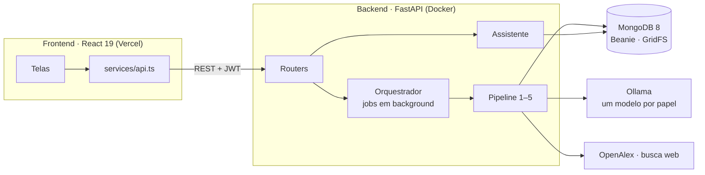

<div align="center">

# Lastro · Lei do Bem

**Apoio à decisão para enquadramento de projetos de P&D na Lei do Bem, com rastro defensável de cada afirmação.**

[](#sobre-o-desafio)
[](#sobre-o-desafio)

[](backend/pyproject.toml)
[](backend/)
[](docker-compose.yml)
[](backend/uv.lock)
[](backend/.env.example)
[](backend/Dockerfile)

[](frontend/package.json)
[](frontend/package.json)
[](frontend/package.json)
[](frontend/package.json)
[](frontend/package.json)
[](frontend/vercel.json)

[](backend/tests/)
[](frontend/src/)
[](frontend/e2e/)

</div>

---

> [!IMPORTANT]
> **O sistema sugere, o analista decide.** O Lastro nunca grava uma classificação final sozinho. A sugestão da
> máquina e a decisão humana (quem, quando, por quê) ficam em registros separados, e nenhuma das duas é sobrescrita.

## Sumário

- [Sobre o desafio](#sobre-o-desafio)
- [O que o Lastro faz](#o-que-o-lastro-faz)
- [Como funciona](#como-funciona)
- [Princípios](#princípios)
- [Interface do analista](#interface-do-analista)
- [Arquitetura e stack](#arquitetura-e-stack)
- [Como rodar](#como-rodar)
- [Testes e benchmark](#testes-e-benchmark)
- [Resultados medidos](#resultados-medidos)
- [Estrutura do repositório](#estrutura-do-repositório)
- [Time](#time)

## Sobre o desafio

Construído no **Hackathon STS 2026** (Siará Tech Summit, Fortaleza, 07–09/10/2026), no desafio proposto pelo
**Banco do Nordeste (BNB) / Hubine + SEBRAE**.

Para usar os incentivos fiscais da **Lei do Bem** (Lei 11.196/2005), o analista de P&D precisa decidir se cada
projeto é pesquisa e desenvolvimento ou rotina, e deixar registrado **por quê**, de um jeito que se sustente numa
fiscalização anos depois. Hoje isso depende de consultoria externa a cada projeto:

| Dor | Consequência |
|---|---|
| Consultoria por projeto | Custo recorrente |
| Parecer em dias | Demora para decidir |
| Critérios aplicados de forma subjetiva | Projetos parecidos recebem respostas diferentes |
| O porquê não fica registrado com as provas | Decisão frágil numa fiscalização do MCTI ou da Receita |

## O que o Lastro faz

O Lastro lê o pacote de um projeto (dossiê, registro técnico, atividades, método, medições, resultados, cronologia,
configuração, entrevista técnica) e avalia os **cinco critérios do Manual de Frascati**:

| Critério | Prefixo | Regras na web | Regras nos documentos |
|---|---|:---:|:---:|
| Novidade | `NOV` | ✅ | ✅ |
| Criatividade técnica | `CRI` | ✅ | ✅ |
| Incerteza tecnológica | `INC` | ✅ | ✅ |
| Sistematicidade | `SIS` | — | ✅ |
| Transferência / reprodutibilidade | `REP` | — | ✅ |

Ao final, **sugere** uma de quatro classes, cada uma com o que o analista precisa para agir:

| Classe | O que acompanha a sugestão |
|---|---|
| ✅ **Elegível** | Evidências por critério |
| ⚠️ **Com ressalvas** | O recorte sustentado, a limitação e a evidência que falta |
| ❌ **Não elegível** | O motivo, com o trecho que o comprova |
| ❔ **Evidência insuficiente** | O elo ausente e o que pedir à equipe do projeto |

Cada afirmação aponta o **trecho literal** do documento que a sustenta. O analista navega pela árvore
critério → regra → evidência, contesta o que discordar e registra a decisão final. O resultado é um **parecer em PDF**
e um **CSV/JSON** no formato do gabarito oficial (27 colunas).

## Como funciona

O backend roda um pipeline de etapas fixas. Cada etapa lê e escreve **só** pelo JSON canônico e pelo grafo de
evidências; nenhum módulo chama outro diretamente.



### 1. Extração determinística

Os arquivos são reconhecidos **pelo conteúdo**, não pelo nome (colunas do cabeçalho, chaves do JSON, títulos; o
cabeçalho do XLSX na linha 5). O código corta o texto em **fragmentos com ID estável** (`PRJ21-EV01#referencia_anterior`,
`metodo.md#2`), que são a unidade de citação. Nenhuma frase ou número passa por geração de texto. Um agente de
extração (LLM) entra só como fallback para arquivos que não foram reconhecidos com confiança.

### 2. Checagens em código (`CHK-*`)

Verificações determinísticas, sem IA, que viram fragmentos citáveis:

- **CHK-RECALC** recalcula `resultados` a partir de `medicoes` (só dentro do mesmo ensaio; vazio ≠ zero);
- **CHK-TEMPO**, **CHK-VERSOES**, **CHK-FALHAS** (com a direção da métrica), **CHK-CONFIG**, **CHK-ESCOPO**;
- **CHK-DIVERG** encontra divergências entre a entrevista e o registro: *"a entrevista diz X; o registro mostra Y;
  prevalece o registro, porque é primário e identificado por versão"*;
- **CHK-PERGUNTA** sinaliza perguntas de pesquisa que já nomeiam a solução conhecida.

### 3. Agentes por critério

O catálogo versionado (`backend/src/backend/catalog/rules.yaml`) tem **66 regras ativas** derivadas do Manual de
Frascati, do Guia da Lei do Bem do MCTI e dos casos históricos. Para cada critério:

- o **sub-agente Doc** lê só os fragmentos que o roteamento da regra aponta e rotula cada um como evidência
  `positiva` ou `negativa`;
- o **sub-agente Web** busca o estado da arte (artigos no OpenAlex, patentes, mercado, documentação técnica), com
  **data de corte** (só conta o que foi publicado antes do início do projeto) e **consultas sanitizadas** (sem código
  de projeto, nome de equipe ou números).

Toda citação passa por um **gate de citação literal**: se o trecho não existe palavra por palavra na fonte, a
evidência é descartada e contabilizada.

### 4. Juiz de estado e classe

Para cada critério, um LLM juiz lê só as evidências daquele critério e responde com o **vocabulário exato** do
gabarito (`DEMONSTRADA NO RECORTE`, `INVESTIGADA`, `DOCUMENTADA COMO ACEITE`…). Depois, gates em código fecham o
resultado:

- **gates do catálogo** forçam a coluna negativa quando a evidência predominante aponta, por exemplo, que uma
  referência anterior já fornecia a função, ou que o método era um aceite e não um experimento;
- um estado positivo sem registro numérico (medições/resultados) vai para a coluna indeterminada;
- o **gate de coerência** compara o estado com a nota do critério e, se houver contradição forte, pede ao juiz que
  decida de novo com a contradição explícita. Se ela persistir, o critério é marcado para revisão humana.

A **classe vem do vetor de estados**, não da média. Vetores que não batem com um padrão do gabarito recebem a sugestão
da árvore de decisão dos históricos (em código) e a marca `inconsistent`.

> [!NOTE]
> **Nota 0–100 é força da evidência, não probabilidade de aprovação.** Nota da regra = positivas ÷ (positivas +
> negativas) × 100; nota do critério = média das regras. Regras sem evidência ficam fora da média (vazio ≠ zero).
> A nota orienta o analista; ela não decide a classe.

O backend também suporta um modo alternativo de juiz (`JUDGE_MODE=questionario`), em que o LLM responde perguntas
fechadas sobre fatos, cada uma com evidências, e uma tabela de decisão versionada converte as respostas no estado.

### 5. Grafo de evidências e parecer

O grafo vive no MongoDB em duas coleções (`nodes`, `edges`), percorridas com `$graphLookup`, com IDs determinísticos
e inserção idempotente. É a memória do sistema: o caminho da classe até o trecho literal é navegável na interface e
no endpoint `GET /analyses/{id}/graph/trace/{node}`. O parecer é montado **a partir do grafo** (não decide nada) e
passa por um gate de números: nenhum número aparece no texto gerado se não estiver no registro.

### IA Assistente

O chatbot responde **só** a partir dos nós do grafo, do catálogo de regras e de uma busca BM25 sobre os PDFs
normativos em `backend/data/normas/` (Lei 11.196, Decreto 5.798, Portaria MCTI 9.563/2025, Manual de Frascati, Guias
do MCTI). Ele explica e cita; não decide.

## Princípios

Vieram do desafio e viraram regras em código (lista completa em [`backend/AGENTS.md`](backend/AGENTS.md)):

1. **O sistema sugere, o analista decide.**
2. **Toda afirmação tem fonte**, com gate de citação literal; citação inventada é descartada.
3. **O LLM rotula e extrai, nunca reescreve.** Números são copiados do registro; quem recalcula é o código.
4. **Vazio ≠ zero.** Regra sem evidência fica fora da média; etapa que falhou aparece como "não executada".
5. **Depoimento não é evidência.** A entrevista é contexto e fonte de divergências, com peso zero na nota.
6. **Divergências são registradas, nunca resolvidas em silêncio.**
7. **Sigilo nas buscas.** Consultas à internet saem sanitizadas, e o par original × sanitizado fica no log.
8. **Conteúdo externo é dado, não instrução** (defesa contra prompt injection em PDFs e páginas web).
9. **Data de corte:** só é estado da arte o que foi publicado antes do início do projeto.
10. **Nunca sobrescrever.** O pacote original é imutável (GridFS + sha256); reanálise cria uma nova versão.
11. **Reprodutibilidade:** temperatura 0, buscas em cache e, em cada análise, hash dos arquivos, modelo por papel,
    hash dos prompts e versão do catálogo.

## Interface do analista

O front-end segue o Figma de alta fidelidade com a identidade do BNB (Heebo, vinho `#A6193C`).

| Rota | Tela |
|---|---|
| `/login` | Login (JWT no modo api) |
| `/projetos` | Meus projetos: cards por situação, filtros, busca, reenvio de arquivo |
| `/projetos/novo` | Upload do pacote (arquivos ou `.zip`), que dispara o pipeline |
| `/projetos/:id/analise` | Árvore de evidências + grafo Critério → Regra → Evidência + decisão por regra |
| `/projetos/:id/decisao` | Documento de decisão: resumo, pendências (divergências, limites, lacunas), classificação final, trilha e exportação em PDF ou CSV |

O nó selecionado fica na URL (`?no=crit-uncertainty.rule-…`), então dá para compartilhar um link que aponta para uma
evidência específica. O assistente fica no canto inferior direito das telas de análise e decisão.

### Três fontes de dados, uma variável

`VITE_DATA_SOURCE` escolhe a fonte sem mudar código. As telas só falam com `src/services/api.ts`.

| Modo | Precisa de backend? | Dados | Para quê |
|---|:---:|---|---|
| `mock` (padrão) | ❌ | ~400 projetos fictícios em memória | Design e apresentação da UI |
| `static` | ❌ | JSONs exportados do MongoDB com casos já analisados | Demo offline com dados reais do pipeline |
| `api` | ✅ | Tudo real: JWT, upload, pipeline, decisões, chatbot | Aplicação completa |

No modo `api`, se o backend cair, o front volta para os mocks e mostra de onde vêm os dados, para quem está vendo
saber o que está vendo.

## Arquitetura e stack



| Camada | Tecnologia | Por quê |
|---|---|---|
| API | Python 3.13, FastAPI, Pydantic | Assíncrona, tipada e fácil de testar |
| Dados | MongoDB 8 + Beanie, GridFS | O projeto é um documento; o grafo usa `nodes`/`edges` com `$graphLookup`; originais imutáveis com sha256 |
| LLM | Ollama (cloud ou local), temperatura 0 | Modelos abertos, um por papel (`extraction`, `doc`, `search`, `judge`, `report`, `chat`), trocados só no `.env`; o mesmo código roda num Ollama local, sem dados saindo da rede |
| Busca | OpenAlex, busca web via Ollama | Estado da arte com data de corte e consultas sanitizadas |
| Documentos | pypdf, openpyxl, fpdf2 | Leitura do pacote e parecer em PDF |
| Auth | JWT access/refresh, argon2 | Cada projeto, análise e decisão pertence ao seu dono |
| Front | Vite 8, React 19 (React Compiler), TypeScript, Tailwind v4, React Router 7, TanStack Query, React Flow + dagre | Árvore, grafo e documento de decisão navegáveis |
| Deploy | Docker (backend), Vercel (front) | `backend/Dockerfile` usa `backend/` como raiz e lê `PORT` da plataforma |

## Como rodar

> Guia completo, com os três modos e solução de problemas: **[COMO-RODAR.md](COMO-RODAR.md)**.

### Pré-requisitos

- Docker (para o MongoDB)
- [uv](https://docs.astral.sh/uv/) e Python 3.13
- Node.js e npm
- Uma chave do [Ollama](https://ollama.com/settings/keys) (para o pipeline e o chatbot) e, para lotes, uma chave
  gratuita do [OpenAlex](https://help.openalex.org/api/authentication/)

### Backend

```bash
docker compose up -d mongo              # MongoDB 8 em localhost:27017

cd backend
cp .env.example .env                    # preencha OLLAMA_API_KEY, OLLAMA_MODEL, JWT_*_SECRET
uv sync
uv run backend                          # http://127.0.0.1:8000  (Swagger em /docs)
```

No primeiro start, o backend cria os analistas de demonstração (`user1@sts.com` … `user5@sts.com`, senha
`senha12345`, configurável em `SEED_PASSWORD`), sincroniza o catálogo de regras e indexa as normas para o chatbot.

### Frontend

```bash
cd frontend
npm install

npm run dev                                                          # mock (fictício, padrão)
VITE_DATA_SOURCE=static npm run dev                                  # static (export do MongoDB)
VITE_DATA_SOURCE=api VITE_API_URL=http://127.0.0.1:8000 npm run dev  # api (backend de verdade)
```

Abra http://localhost:5173. O front precisa estar na porta **5173**, porque é a origem que o CORS do backend aceita
por padrão (`CORS_ORIGINS`).

### CLIs do backend

```bash
uv run backend-import <pasta>                     # importa e analisa cada projeto da pasta como lote
uv run backend-benchmark --projects PRJ01,PRJ02   # benchmark contra o gabarito
uv run backend-benchmark report <id> --out m.html # relatório HTML de métricas (tempo, tokens, custo, gates)
uv run backend-checks <benchmark_id>              # checagens determinísticas sobre análises salvas (zero tokens)
uv run backend-entrega run --yes                  # analisa os casos de entrega (retomável)
uv run backend-entrega export <id> --out <pasta>  # pareceres, CSV/JSON e rastreabilidade (fora do repo)
uv run backend-export-frontend --include-benchmark --out ../frontend/static-api   # dados do modo static
uv run backend-ingest-norms                       # reindexa os PDFs normativos
```

### Principais endpoints

| Método | Rota | O que faz |
|---|---|---|
| `POST` | `/projects` | Upload multipart ou `.zip`; devolve o projeto e dispara a análise |
| `GET` | `/projects` | Lista paginada e filtrável |
| `GET` | `/analyses/{id}/status` | Status por etapa |
| `GET` | `/analyses/{id}/graph` · `/graph/trace/{node}` | Grafo de evidências e o caminho até a fonte |
| `GET` | `/analyses/{id}/report.{pdf,csv,json}` | Parecer |
| `GET` `POST` | `/projects/{id}/decisions` · `contestations` · `rule-decisions` · `evidence-reviews` | Trilha do analista (append-only) |
| `POST` | `/contestations/{id}/reanalysis` | Reanálise como nova versão |
| `POST` | `/assistant/ask` · `/assistant/debate` | IA Assistente |
| `GET` | `/regras` · `/regras/{id}` | Catálogo de regras |

## Testes e benchmark

```bash
# backend (precisa do Mongo no ar; LLM e web são simulados)
cd backend && uv run pytest
uv run pytest -m live            # opt-in: ponta a ponta com o Ollama real

# frontend
cd frontend
npm test                         # Vitest
npm run lint                     # oxlint
npm run build                    # tsc -b && vite build
npm run test:e2e                 # Playwright: jornadas completas no navegador
```

Os testes usam um **pacote sintético** (`backend/tests/factories.py`) e fakes de LLM e de busca
(`backend/tests/fakes.py`). O pacote real do hackathon é confidencial e nunca entra no repositório.

O **benchmark** (`backend/src/backend/benchmark/`) roda o pipeline real sobre os casos históricos e mede: acerto de
classe e de estado por critério contra o gabarito oficial, matriz de confusão, kappa, falsos elegíveis, tempo por
etapa, chamadas e tokens por modelo, custo, cobertura de regras, o que os gates barraram e concordância entre
repetições. O modo `--rejudge` refaz só a conclusão sobre as evidências salvas, o que permite testar uma mudança no
juiz por uma fração do custo.

## Resultados medidos

Rodada completa do pipeline (do zero, configuração padrão deste repositório) contra o gabarito oficial de 10 casos
históricos, em 09/10/2026, com gpt-oss:120b (documentos e juiz), gpt-oss:20b (busca) e gemma4:31b (extração e
parecer):

| Métrica | Valor |
|---|---|
| **Falsos elegíveis** | **0 em todas as rodadas medidas** |
| Tempo por parecer | ~5–7 min (mediana) |
| Tokens por parecer | ~240 mil, ~60 chamadas de LLM |
| Custo por parecer (preço por token do Ollama) | ~US$ 0,045 (≈ R$ 0,22) |
| Evidências com fonte citada | 100% (351 evidências em 10 pareceres) |
| Barrado pelos gates (mesma rodada) | 112 citações inventadas descartadas, 69 fontes posteriores ao início separadas, 10 divergências entrevista × registro registradas |

> [!WARNING]
> **Leitura honesta.** Numa rodada completa, o acerto de classe fica em torno de 40–50%. O erro dominante é
> sugerir "Evidência insuficiente" para projetos que são P&D: o sistema erra para o lado seguro e nunca sugeriu
> Elegível para um projeto que não era. Re-julgando evidências já coletadas, o juiz por questionário chegou a 87,5%
> das classes, mas esse número não vale para o pipeline completo. Calibração e testes usam só os casos históricos;
> o sistema **nunca** classifica por similaridade com eles.

## Estrutura do repositório

```
.
├── backend/                  # FastAPI + MongoDB (Python 3.13, uv)
│   ├── data/normas/          # PDFs normativos indexados para o chatbot (BM25)
│   ├── src/backend/
│   │   ├── extraction/       # 1. pacote → JSON canônico com fragmentos citáveis
│   │   ├── checks/           # 2. checagens CHK-* (zero tokens)
│   │   ├── criteria/         # 3. agente por critério: sub Doc + sub Web, gate de citação
│   │   ├── search/           # OpenAlex, busca web, cache, sanitizador, aterramento
│   │   ├── graph/            # 4. nota, juiz, gates, classe, grafo de evidências
│   │   ├── report/           # 5. parecer PDF, CSV/JSON de 27 colunas, calibração
│   │   ├── analyses/         # orquestrador, versões, jobs, lotes
│   │   ├── review/           # decisões, contestações, reanálise (append-only)
│   │   ├── assistant/        # IA Assistente: grafo + catálogo + normas
│   │   ├── catalog/          # rules.yaml, questionario.yaml, handbooks por critério
│   │   ├── benchmark/        # métricas contra o gabarito, rejudge, relatório HTML
│   │   ├── delivery/         # execução e exportação dos casos de entrega
│   │   ├── frontend_api/     # projeção para o contrato do front + export estático
│   │   └── llm/              # cliente Ollama, registro de prompts, medição de uso
│   ├── tests/                # unit/, api/, live/ (opt-in)
│   └── Dockerfile
├── frontend/                 # Vite + React 19 + TypeScript
│   ├── src/
│   │   ├── domain/           # tipos (contrato da API), nota, árvore
│   │   ├── services/         # camada única de dados (mock · static · api)
│   │   ├── features/         # projects, analysis (árvore + grafo), decision, assistant, auth
│   │   └── pages/            # uma pasta por rota
│   └── e2e/                  # jornadas Playwright
├── docs/superpowers/         # specs e planos da integração front × back
├── docker-compose.yml        # MongoDB 8
└── COMO-RODAR.md             # guia dos três modos de execução
```

Mais detalhes: [`backend/AGENTS.md`](backend/AGENTS.md) (arquitetura, domínio e convenções do backend) e
[`frontend/README.md`](frontend/README.md) (telas e onde mexer no front).

## Time

| Pessoa | Frente |
|---|---|
| **João Pedro Lima** | Front-end |
| **André Paiva Garcia** ([@andregarcia0412](https://github.com/andregarcia0412)) | Backend e pipeline de IA |
| **João Victor Barreto** ([@Jv1ctor](https://github.com/Jv1ctor)) | Integração front × back, export estático e merge final |

O visual de alta fidelidade veio do Figma de um designer parceiro do time.

---

<div align="center">
<sub>
Análise preliminar de apoio à decisão. Não substitui o parecer oficial do MCTI.<br/>
Os dados do desafio são fictícios e confidenciais e não fazem parte deste repositório.
</sub>
</div>
