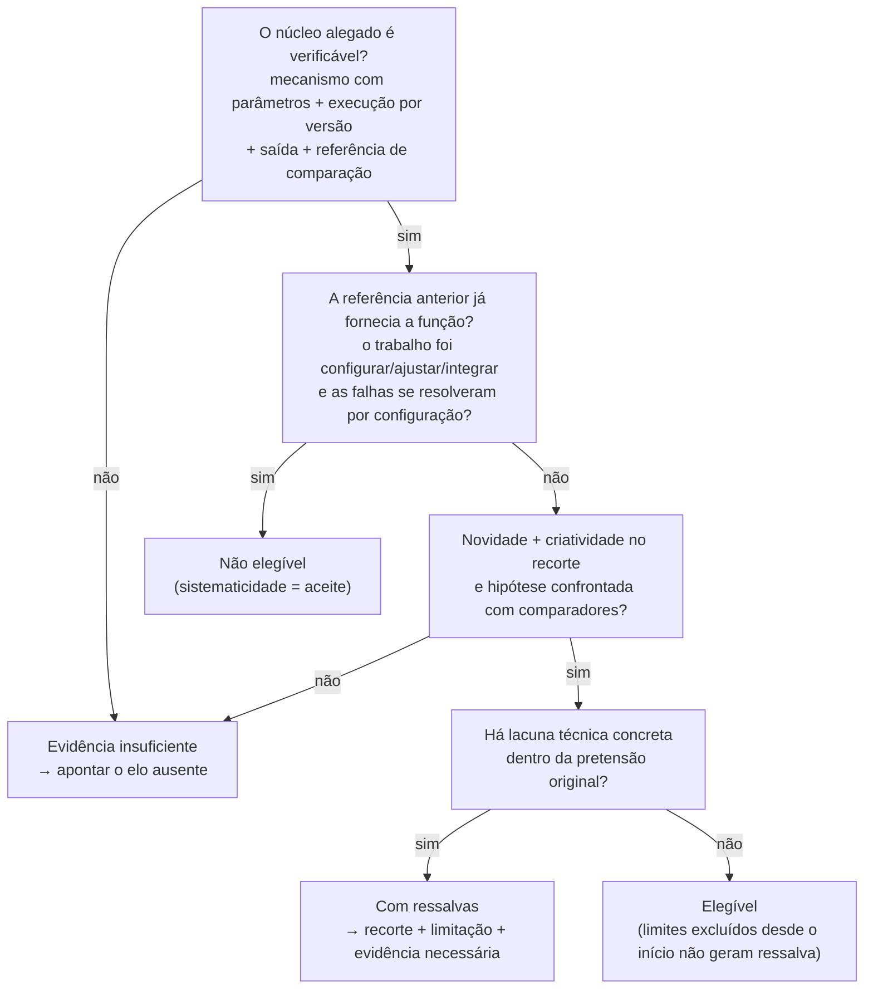

# Padrão de Análise dos Históricos

O que os avaliadores olharam nos 20 projetos históricos classificados (PRJ01–PRJ20) do pacote do
desafio, e o padrão que se repete. Serve de **calibração** para as
[[Regras de Validação dos Critérios de Frascati]] — não de gabarito para copiar: o
[[GUIA_DO_PARTICIPANTE|Guia do Participante]] proíbe classificar "por semelhança".

Fontes: [[historicos_classificados]] (justificativas), os arquivos de cada projeto em
`HACKATHON STS 2026-pacote_participantes_lei_do_bem_v10/01_projetos/01_historico/`, o [[LEIA_ME]] e o
[[GUIA_DO_PARTICIPANTE]].

## 1. O padrão central: estado por critério → classe

Cada critério recebe um **estado** (vocabulário fixo) e a classe decorre da combinação. Nos 20 históricos
o mapeamento é **100% determinístico** — cada classe tem uma única combinação:

| Classe | Novidade | Criatividade | Incerteza | Sistematicidade | Transferência/reprodução | Projetos |
|---|---|---|---|---|---|---|
| **Elegível** (6) | DEMONSTRADA NO RECORTE | DEMONSTRADA NO RECORTE | INVESTIGADA | DOCUMENTADA | DOCUMENTADA NO ESCOPO | 02, 03, 13, 14, 15, 16 |
| **Com ressalvas** (4) | DEMONSTRADA NO RECORTE | DEMONSTRADA NO RECORTE | INVESTIGADA | DOCUMENTADA | DOCUMENTADA **COM LIMITE** | 05, 06, 07, 18 |
| **Não elegível** (7) | NÃO DEMONSTRADA | NÃO DEMONSTRADA | NÃO CARACTERIZADA | DOCUMENTADA **COMO ACEITE** | DOCUMENTADA **PARA A CONFIGURAÇÃO** | 01, 04, 09, 11, 12, 19, 20 |
| **Evidência insuficiente** (3) | INDETERMINADA | INDETERMINADA | ALEGADA, NÃO VERIFICÁVEL | PARCIAL | INSUFICIENTE PARA O NÚCLEO ALEGADO | 08, 10, 17 |

> [!important] O que isso revela
> - **Novidade, criatividade e incerteza** separam P&D de rotina. Andam sempre juntas.
> - **Sistematicidade e reprodução existem também na rotina** (testes de aceite bem documentados), então
>   sozinhas **não** provam P&D: o que muda é *o que* foi sistematizado — um experimento ou um aceite.
> - **Reprodução "com limite"** é o que separa Elegível de Com ressalvas.
> - **Falta do núcleo verificável** (mecanismo executado + saída + referência) leva a Evidência insuficiente,
>   mesmo havendo plano, diagrama e algumas medições.

### Árvore de decisão equivalente

### Onde cada critério buscou a prova

| Critério | Arquivo citado nos históricos |
|---|---|
| Novidade | `metodo.md#1` — Referência anterior |
| Criatividade | `metodo.md#2` — Mecanismo e hipótese |
| Incerteza | `metodo.md#2` (ou `revisao_tecnica.md` quando não verificável) |
| Sistematicidade | `medicoes.csv` — registro primário |
| Transferência/reprodução | `revisao_tecnica.md` (P&D) ou `metodo.md#3` (rotina) |

A entrevista **nunca** é a fonte de um critério; aparece só no campo de divergência.

## 2. O que foi decisivo em cada projeto

| Projeto | Classe | Elemento decisivo |
|---|---|---|
| PRJ01 Mensagens duplicadas | Não elegível | Manual BARR-2, **anterior ao projeto**, já descrevia a chave e a retenção; o trabalho foi mudar a retenção de 30 para 120 s, dentro da faixa já admitida pelo produto. "Nenhum algoritmo do barramento foi modificado." |
| PRJ02 Razão × extrato | Elegível | Comparadores conhecidos (texto, faixa, bipartido) com **limitação específica** nomeada; mecanismo com custo, janela e **margem de abstenção** explícitos; 4 alternativas na **mesma referência lacrada**; critérios fixados antes da rodada; análise do **estrato ambíguo**. Entrevista diverge (1.100 × 1.152). |
| PRJ03 Reexecução após falhas | Elegível | Controle reativo conhecido falha num cenário específico (acelera e recria sobrecarga); acoplamento p95 + derivada da fila **com histerese** — "não um novo nome para retry". Limite: sequências mais longas **não reivindicadas** → sem ressalva. |
| PRJ04 Painel de conciliação | Não elegível | Catálogo VIS-3 já fazia junção e mascaramento; trabalho = configurar consulta e corrigir uma permissão. |
| PRJ05 App offline | Com ressalvas | P&D sustentado para queda de rede; a própria hipótese do protocolo sobre **corte de energia** não foi ensaiada (`corte_energia_executado: false`). Entrevista nega falha que o comparador teve (2/8). |
| PRJ06 Sincronização | Com ressalvas | Mesclagem por dependência medida contra "última gravação" e "três vias"; **exclusão concorrente** referenciada fazia parte da pretensão e não foi ensaiada. A ressalva é técnica, "não sobre ausência abstrata de reprodução por outra equipe". |
| PRJ07 Autenticação em aparelhos simples | Com ressalvas | Etapas com nonce vs. biblioteca completa e leve; ataque de **adulteração local** previsto não foi testado; "sem converter vinte replays em prova de segurança geral". |
| PRJ08 Monitoramento de agências | Insuficiente | `limiares: null`, `versao_classificador: null`; só 6 medições sem causa nem saída; memorando DEMO-08 sem IDs; resultado = **contagem de entrega**. |
| PRJ09 Gateway "adaptativo" | Não elegível | Manual GATE-4 já roteava por versão; "adaptativo" é só o **título comercial**. |
| PRJ10 Consentimentos | Insuficiente | Diagrama sem tabela de precedência, empate nem idempotência; `versao_executada: null`; eventos sem saída do serviço; MEMO-10 sem número verificável. |
| PRJ11 Normalização de contas | Não elegível | Dicionário DIC-11 anterior define todas as transformações; "a automação de um trabalho útil não basta". |
| PRJ12 Cofre de chaves | Não elegível | Cofre COF-2 contratado; o manual já recomendava a janela que resolveu a falha. Sem primitiva ou protocolo novo. |
| PRJ13 Comportamento transacional | Elegível | Quarentena + abertura condicionada de faixa contra 3 métodos conhecidos; limiares definidos **na preparação**; rótulo atrasado para o atualizador; denominador explícito (falso alerta ≠ prevalência). |
| PRJ14 Novos padrões de golpe | Elegível | Ciclo de vida causal de arestas vs. pontuação individual e grafo com expiração fixa; verdade de referência **antes** da comparação; restrição operacional (≤ 25 alertas extras/lote) como critério. |
| PRJ15 Explicação de alertas | Elegível | Snapshot dos fatos consumidos + replay da mesma versão do motor; ordem de leitura **contrabalançada** entre analistas. Entrevista atribui à versão final um número da versão anterior. |
| PRJ16 Simulador de ataques | Elegível | Liberação causal com desempate documentado vs. roteiro manual e replay; **5 repetições** por ataque para separar falha intermitente. Transferência = especificação + resultados sintéticos. |
| PRJ17 Políticas de crédito | Insuficiente | Políticas só "antiga/nova", sem limiares nem versão; não se sabe se o motor mudou ou se era parâmetro do simulador comercial; "a lacuna afeta o próprio objeto". |
| PRJ18 Motor de regras auditável | Com ressalvas | Registro por mudança de estado vs. log integral e amostragem; **critério prévio de 100% não atingido** (96%) por callback tardio — "falhar no objetivo não elimina o caráter de pesquisa". |
| PRJ19 Leitura de documentos | Não elegível | OCR-5 já tinha as funções; aplicar e fixar limiar 0,85; "não treinar modelo nem alterar pré-processador". |
| PRJ20 Motor antigo × novo | Não elegível | Modo sombra é função da plataforma SIM-4; divergências eram **diferenças de política**, "não falha científica a resolver". |

## 3. Sinais por classe

| Classe | Sinais recorrentes nos arquivos |
|---|---|
| **Elegível / Com ressalvas** | `metodo.md#1` lista alternativas conhecidas **e o modo de falha de cada uma** no problema; `#2` traz regra de decisão com números (pesos, limiares, janelas) e às vezes pseudocódigo; 3–4 versões, incluindo os **comparadores rodados na mesma entrada**; critérios de sucesso fixados antes; resultados de desempenho com denominador; o limite da conclusão diz o que **não** foi reivindicado |
| **Não elegível** | Referência anterior é manual/catálogo/produto **contratado**, anterior ao projeto, que já faz a função; verbos do mecanismo: *configurar, ativar, cadastrar, mapear, ajustar, aplicar receita*; parâmetro mudado dentro de faixa já suportada; v1 falha por configuração e v2 passa 100% (aceite); pergunta registrada já nomeia a solução ("como **aplicar idempotência conhecida**", "como **integrar ao cofre contratado**") |
| **Evidência insuficiente** | Parâmetros-chave `null` em `configuracao.json`; uma só versão; resultados só de **entrega** (`taxa_percentual` vazia); memorando (DEMO/MEMO) afirma resultado sem IDs de evento, matriz ou saídas; diagrama/plano sem execução registrada |
| **Ressalva (o que a diferencia)** | Uma hipótese ou cenário **da própria pretensão** ficou sem ensaio (flag `..._executado: false`, "próxima ação: executar …") ou um **critério prévio não foi atingido** |

> [!warning] Sinais que **não** distinguem as classes
> - Ter "próxima ação" / continuidade: todos os 20 têm.
> - Ter testes, roteiros e 100% de aprovação: os 7 não elegíveis têm (aceite perfeito pode ser rotina).
> - Ter falhas registradas: rotina também tem (falha de configuração ≠ falha experimental).
> - Inventário com todos os arquivos "Localizada": todos os 20 têm.
> - Natureza declarada pela equipe nas atividades: tem a mesma distribuição em todos (Guia do Participante).

## 4. Divergência entre entrevista e registros

Seis históricos têm divergência (PRJ02, 05, 07, 13, 15, 18) — **4 tipos**, sempre resolvidos a favor do
registro primário identificado por versão, e **nenhum muda a classe sozinho**:

| Tipo | Exemplo |
|---|---|
| Número diferente | PRJ02: entrevista 1.100 pares; S05 registra 1.152/1.200 |
| Número de outra versão | PRJ15: 78/80 é de rastro-v1; a final rastro-v2 tem 80/80 |
| Base/denominador | PRJ13: 2,8% citado × 1.116/36.000 = 3,1% nas legítimas |
| Ausência ou totalidade de falhas | PRJ05 nega leitura indevida (banco-v1 teve 2/8); PRJ07 lembra replay aceito (etapas-v3 teve 0/20); PRJ18 diz "todas" (96%) |

Formato usado nas justificativas: *"A entrevista afirma X; o registro Y (arquivo, ensaio) mostra Z;
prevalece o registro, por ser primário e identificado por versão."*

## 5. Novas regras derivadas

Viraram regras nos catálogos de cada critério (seções "Regras derivadas dos históricos"):

- [[Novidade — Regras de Validação#Regras derivadas dos históricos]] — NOV-D10 a NOV-D12 (NOV-D9 foi fundida na NOV-D2)
- [[Criatividade — Regras de Validação#Regras derivadas dos históricos]] — CRI-D8 e CRI-D10 (CRI-D9 foi fundida na CRI-D5)
- [[Incerteza — Regras de Validação#Regras derivadas dos históricos]] — INC-D12 (INC-D11 → INC-D9; INC-D13 → INC-D1)
- [[Sistematização — Regras de Validação#Regras derivadas dos históricos]] — SIS-D12 a SIS-D14 (SIS-D11 → SIS-D5)
- [[Reprodutibilidade — Regras de Validação#Regras derivadas dos históricos]] — REP-D7 a REP-D9
- Transversais T9–T15 e a revisão das regras antigas: [[Regras de Validação dos Critérios de Frascati]]

Relacionadas: [[STS 2026 — Arquitetura de Agentes]] · [[Fluxo do Backend]] · [[Dossiê e Rastreabilidade]]
