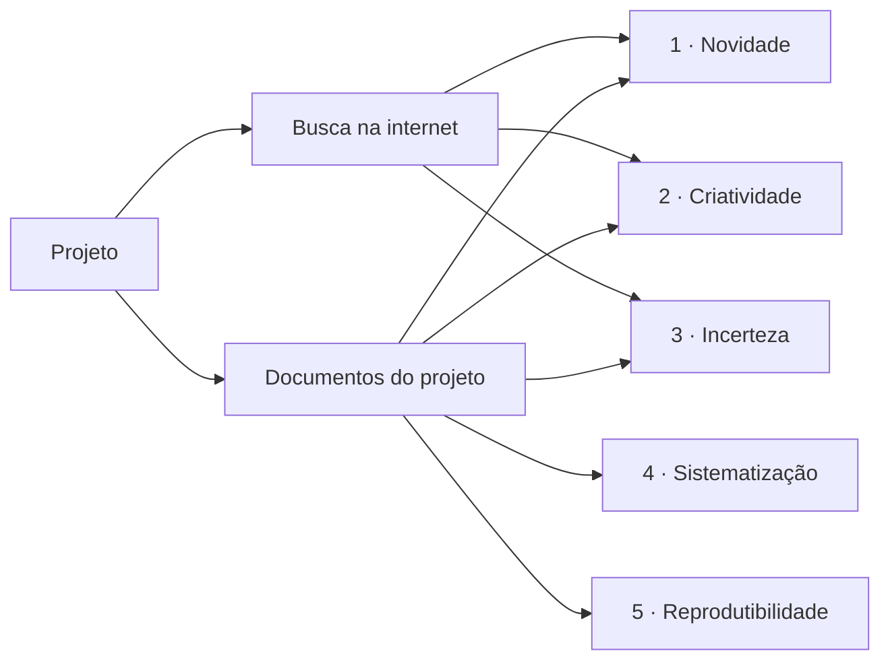

# Regras de Validação dos Critérios de Frascati

Resultado da tarefa da [[2026-10-05-sts|reunião 2]]: *"critérios para os blocos"* + *"trazer referências
para os critérios 1, 2, 3, 4 e 5"*. Para cada critério do
[[Critérios de Frascati — Os Cinco Testes de P&D|teste de Frascati]] há uma lista de **regras
verificáveis**, separadas pela fonte de evidência combinada na reunião.

| # | Critério | Nota | Internet | Documentos |
|---|---|---|---|---|
| 1 | Novidade | [[Novidade — Regras de Validação]] | NOV-W1…W8 | NOV-D1…D12 |
| 2 | Criatividade | [[Criatividade — Regras de Validação]] | CRI-W1…W5 | CRI-D1…D10 |
| 3 | Incerteza | [[Incerteza — Regras de Validação]] | INC-W1…W4 | INC-D1…D13 |
| 4 | Sistematização | [[Sistematização — Regras de Validação]] | — | SIS-D1…D14 |
| 5 | Transferibilidade / Reprodutibilidade | [[Reprodutibilidade — Regras de Validação]] | — | REP-D1…D9 |

Regras `-D` a partir de NOV-D9, CRI-D8, INC-D11, SIS-D11 e REP-D7 vieram dos 20 projetos históricos do
pacote; o padrão de decisão (estado por critério → classe) está em [[Padrão de Análise dos Históricos]].

> [!note] Regras absorvidas (revisão de redundância, 08/10/2026)
> Fundidas sem renumerar — o ID fica na tabela como marcador e **não é reutilizado nem executado**:
>
> | Absorvida | Destino | Motivo |
> |---|---|---|
> | NOV-D9 | NOV-D2 | estado da arte com o modo de falha de cada alternativa |
> | NOV-D7, SIS-D8 | T2 | plurianual repetido 3 vezes |
> | CRI-D9 | CRI-D5 | configurar/ajustar parâmetro não é criativo |
> | INC-D11 | INC-D9 | falha operacional ≠ experimental |
> | INC-D13 | INC-D1 | política de negócio não é incerteza técnica |
> | SIS-D6 | T5 | registro contemporâneo |
> | SIS-D9 | CRI-D3 + SIS-D3 | pesquisador / adequação da equipe |
> | SIS-D11 | SIS-D5 | experimento × aceite |
>
> Sobreposições parciais foram só aparadas: NOV-D12 (metade igual à T13), T13 (metade igual à T4),
> SIS-D1 (unidade = T1), SIS-D14 (operação/base/unidade → T11), REP-D9 (hierarquia → T9).
> Sobreposições **entre critérios** (mesma checagem de dados) ficam como **checagens compartilhadas** em
> [[organizacao-dados-por-criterio]].

Todas as fontes, com links e como foram lidas: [[Regras de Validação — Referências]].

## Formato de cada regra

Cada regra tem **ID · o que verificar · evidência que a sustenta · fontes** (documento + § ou página).

- **ID** = `critério-fonte-número` (ex.: `NOV-W3` = Novidade, Web, regra 3; `SIS-D2` = Sistematização,
  Documentos, regra 2). A ideia é que cada evidência do grafo de evidências aponte para o ID da regra
  que ela sustenta → responde "qual regra foi usada?" do [[Dossiê e Rastreabilidade|dossiê]].
- Regra **não é veredito**: uma regra que falha vira um sinal para o analista, não um "não é P&D".
- Sem pontuação (decisão da tarefa): nenhuma fonte oficial dá nota numérica aos critérios — o MCTI emite
  parecer (ver [[Como o MCTI Avalia o FORMP&D]]).

## Regras transversais (valem para todos os blocos)

| ID | Regra | Fontes |
|---|---|---|
| T1 | Os cinco critérios são **cumulativos** e verificados **por projeto** (o projeto é a unidade, não o departamento) | Frascati 2015 §2.8, §2.13; Guia MCTI 2020 §6; FAQ MCTI P4(d) |
| T2 | Projeto plurianual: verificar **cada ano-base** separadamente e dizer o que é novo e o que foi feito **naquele** ano (texto não repetido) — absorve NOV-D7 e SIS-D8 | Frascati 2015 §2.8; Guia MCTI 2020 Ap. B.4; FAQ MCTI P4 |
| T3 | A comparação é sempre com o conhecimento disponível **na data de início do projeto** | HMRC GfC3 parte 2, passo 5; IE Revenue TDM 29-02-03 §8.1(e); IT MIMIT 2024 §1.1.3.1; LPI art. 11 §1º (analogia) |
| T4 | **Resultado negativo não desqualifica**: a hipótese refutada também é conhecimento novo | Frascati 2015 §2.20; Guia MCTI 2020 §6.2; UK DSIT ¶10; CRA SR&ED; 26 CFR §1.174-2(a)(1) |
| T5 | Evidência **contemporânea** — datada e com autor (atas, relatórios de teste, logs de experimento, versões) — vale mais do que documento reconstruído depois — absorve SIS-D6 | IE TDM §3.1 e §8.4; AU R&DTI (registros feitos na hora); CRA SR&ED ("How": evidência gerada durante o trabalho); Guia ANPEI 2017 p. 27 ("arqueologia documental") |
| T6 | A string de busca enviada para a internet **não pode conter dado sigiloso ou identificável** do projeto *(regra derivada por nós)* | Guia do desafio, Parte 6 (dados fiscais não podem sair de ambiente controlado) |
| T7 | A ferramenta **sinaliza**, o analista **decide**; LLM sozinho não é confiável para julgar novidade — o julgamento tem de citar documentos recuperados | Guia do desafio, Parte 3; Schopf & Färber 2026 (RINoBench); Sinhahajari et al. 2026 (RQ-Bench); Zhang et al. 2026 (OpenNovelty) |
| T8 | **Software** só é P&D se a conclusão depende de avanço científico/tecnológico e o objetivo é resolver uma incerteza de forma sistemática | Frascati 2015 §2.68–2.73; Frascati 2002 (PT) §135 → [[Projetos de Software e IA na Lei do Bem]] |

### Transversais derivadas dos históricos

Vieram do tratamento de evidências nos 20 projetos históricos e das instruções do pacote
([[LEIA_ME]], [[GUIA_DO_PARTICIPANTE]]). Detalhes em [[Padrão de Análise dos Históricos]].

| ID | Regra | Fontes |
|---|---|---|
| T9 | **Hierarquia de prova:** registro primário identificado por versão (`medicoes.csv`) > derivado (`resultados.csv`) > síntese (dossiê, registro técnico) > depoimento (entrevista) > memorando sem IDs. A entrevista **nunca** sustenta sozinha um critério | LEIA_ME; Guia do Participante; Históricos (nenhum critério cita a entrevista) |
| T10 | **Divergência entrevista × registro:** registrar as duas versões com ID e dizer qual prevalece ("a entrevista afirma X; o registro Y mostra Z; prevalece o registro, por ser primário e identificado por versão"). Não esconder nem resolver em silêncio | Guia do Participante; Históricos PRJ02, 05, 07, 13, 15, 18 |
| T11 | Antes de comparar números, conferir **versão, escopo, unidade e denominador**; cada resultado precisa de **operação, base e unidade** explícitas (ex.: % de falso alerta nas legítimas ≠ prevalência de fraude; latência média de 4 registros ≠ média das decisões) | LEIA_ME (dicionário de resultados); Históricos PRJ13, PRJ18 |
| T12 | **"Localizada" no inventário = arquivo presente**, não alegação provada. Não presumir arquivos citados em conversa | LEIA_ME; os 20 históricos têm inventário 100% "Localizada" |
| T13 | **Aceite perfeito pode ser rotina** (o inverso — resultado desfavorável pode ser P&D — é a T4). Complexidade, valor de negócio, uso de IA, número de testes e natureza declarada pela equipe não determinam a classe | LEIA_ME; Guia do Participante; Históricos PRJ01 (100% e não elegível), PRJ18 (meta não atingida e P&D) |
| T14 | Registrar evidências **favoráveis, contrárias, ausentes e contraditórias** para cada critério | Guia do Participante, ordem de leitura (passo 9) |
| T15 | Os históricos são **calibração**, não gabarito: não classificar por semelhança com um histórico; a classe sai das evidências do próprio projeto | Guia do Participante ("Uso dos projetos históricos") |

### Revisão das transversais antigas com o pacote do desafio

- **T6 (sigilo na busca):** continua valendo para projetos reais. Na massa fictícia, o Guia do Participante
  **permite e incentiva** APIs externas de LLM; o LEIA_ME diz que os dados não podem sair do ambiente
  indicado pela organização. Busca na web com trechos do projeto **não está explicitamente autorizada** →
  pergunta para a organização.
- **T7:** reforçada — o Guia do Participante diz que "a resposta do modelo não substitui a decisão humana".
- **T2:** não se aplica à massa (não há projetos plurianuais).

## Classes e estados (taxonomia do desafio)

O pacote usa 4 classes — Elegível, Com ressalvas, Não elegível, Evidência insuficiente — e cada critério
recebe um estado. Nos 20 históricos a classe decorre **sempre** da combinação de estados:

| Critério | P&D | Rotina | Insuficiente |
|---|---|---|---|
| Novidade | demonstrada no recorte | não demonstrada | indeterminada |
| Criatividade | demonstrada no recorte | não demonstrada | indeterminada |
| Incerteza | investigada | não caracterizada | alegada, não verificável |
| Sistematicidade | documentada | documentada **como aceite** | parcial |
| Reprodução | no escopo (Elegível) · **com limite** (Com ressalvas) | para a configuração | insuficiente para o núcleo |

- **Com ressalvas** exige: recorte sustentado + limitação técnica concreta + evidência necessária.
- **Evidência insuficiente** exige: o elo ausente + as evidências a solicitar.
- Árvore de decisão e exemplos: [[Padrão de Análise dos Históricos]].

## Hierarquia das fontes

1. **Normas brasileiras** (vinculantes): Lei 11.196/2005, Decreto 5.798/2006, Portaria MCTI 9.563/2025.
2. **Orientação oficial do MCTI**: Guia Prático 2020, FAQ, Guia ANPEI/MCTIC 2017 — e o **Manual de
   Frascati**, que o MCTI adota como referência conceitual (Guia ANPEI 2017, p. 20).
3. **Fiscos estrangeiros** (UK, Canadá, Austrália, EUA, Irlanda, Itália) e o inquérito oficial português
   IPCTN — **sem valor legal no Brasil**; usados só para tornar os critérios verificáveis.
4. **Busca de anterioridade** (LPI, INPI, EPO, WIPO) — analogia para a busca na internet.
5. **Artigos acadêmicos** — indicadores e métodos de apoio.
6. **Consultorias** — secundárias; trouxeram pouco de específico.

## Divergências encontradas

> [!warning] Novidade para quem?
> Frascati §2.15, FAQ MCTI P4(a) e os fiscos UK/IE/IT exigem novidade **no setor**. O Guia ANPEI 2017
> (pp. 18 e 24) aceita "novidade para a empresa, setor, mercado nacional ou internacional" — mas dentro
> de uma seção sobre *inovação* (PINTEC/Oslo), não sobre P&D. Os EUA (26 CFR §1.41-4(a)(3)(ii)) nem
> exigem superar o conhecimento comum. Detalhes em [[Novidade — Regras de Validação]].

- **Documentação reconstruída depois:** a Itália aceita reconstrução *ex post* se rastreável a recursos e
  tempo (MIMIT §1.1.3.4); a Irlanda exige registros contemporâneos (TDM §3.1).
- **Criatividade × atividade inventiva:** Frascati não exige patenteabilidade. O teste de não-obviedade
  das patentes entra só como heurística — ele tem respaldo porque o próprio Guia MCTI 2020 §6 usa a
  linguagem de "solução não óbvia" (vinda do Frascati 2002 §84).
- **Erro numa fonte:** as Linee guida italianas (§1.1.3.5) atribuem ao "par. 2.50" do Frascati um trecho
  que na edição 2015 é o **§2.20**. Usamos §2.20.

## Perguntas para a banca / mentores

- [ ] O MCTI aceita novidade "para a empresa" ou exige novidade no setor? *(no desafio, o Guia do
  Participante já diz que inovação para a empresa não basta — falta confirmar para projetos reais)*
- [ ] Que documentos um projeto do BNB costuma ter (atas, apontamento de horas, relatórios de teste)?
  Isso define quais regras SIS e REP dá para verificar de fato.
- [ ] Que bases externas podemos consultar com informações do projeto, dado o sigilo (regra T6)?
- [x] Como o dossiê deve registrar um critério **inconclusivo** (nem sim nem não)? → respondido pelo pacote:
  estados "indeterminada" / "alegada, não verificável" e a classe **Evidência insuficiente**, com o elo
  ausente ([[Padrão de Análise dos Históricos]])
- [ ] Busca na web com trechos dos projetos fictícios é permitida? (o Guia do Participante só autoriza
  explicitamente APIs de LLM)

Relacionadas: [[STS 2026 Lei do Bem MOC]] · [[Prova de Não Rotina]] · [[Principais Motivos de Glosa]] ·
[[FORMP&D — O Formulário Anual]] · [[LLMs de Fronteira como Avaliadores por Rubrica]]
